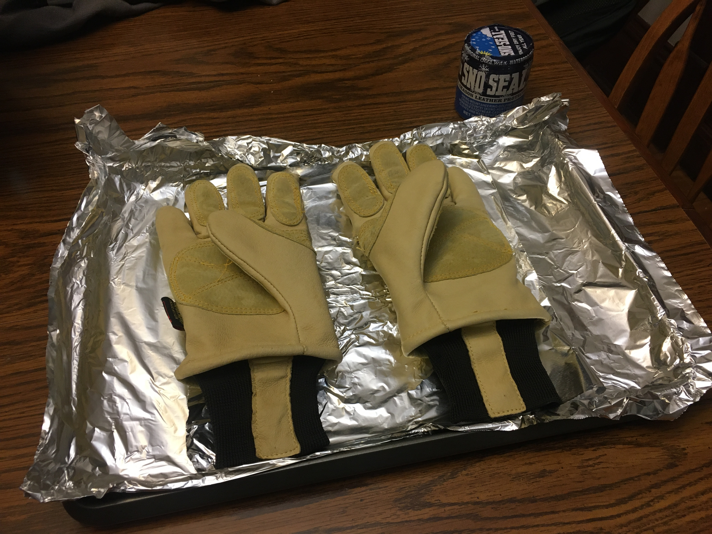
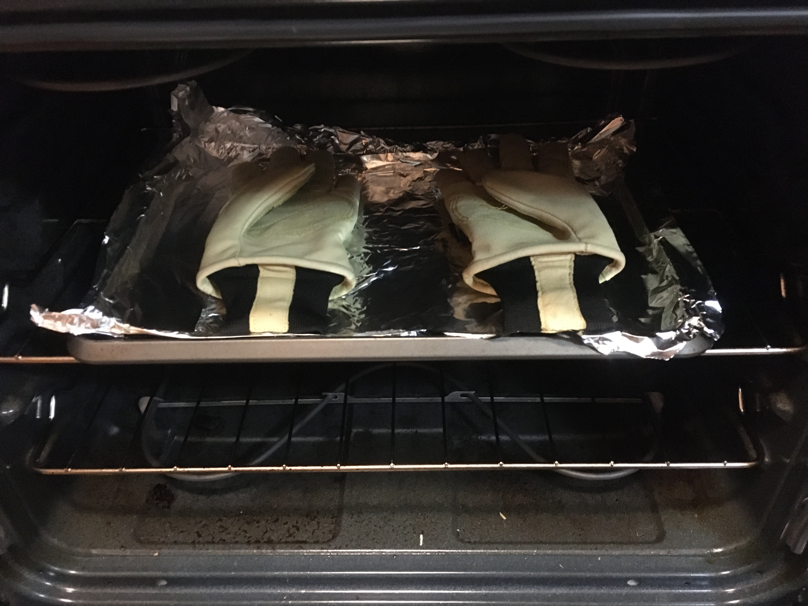
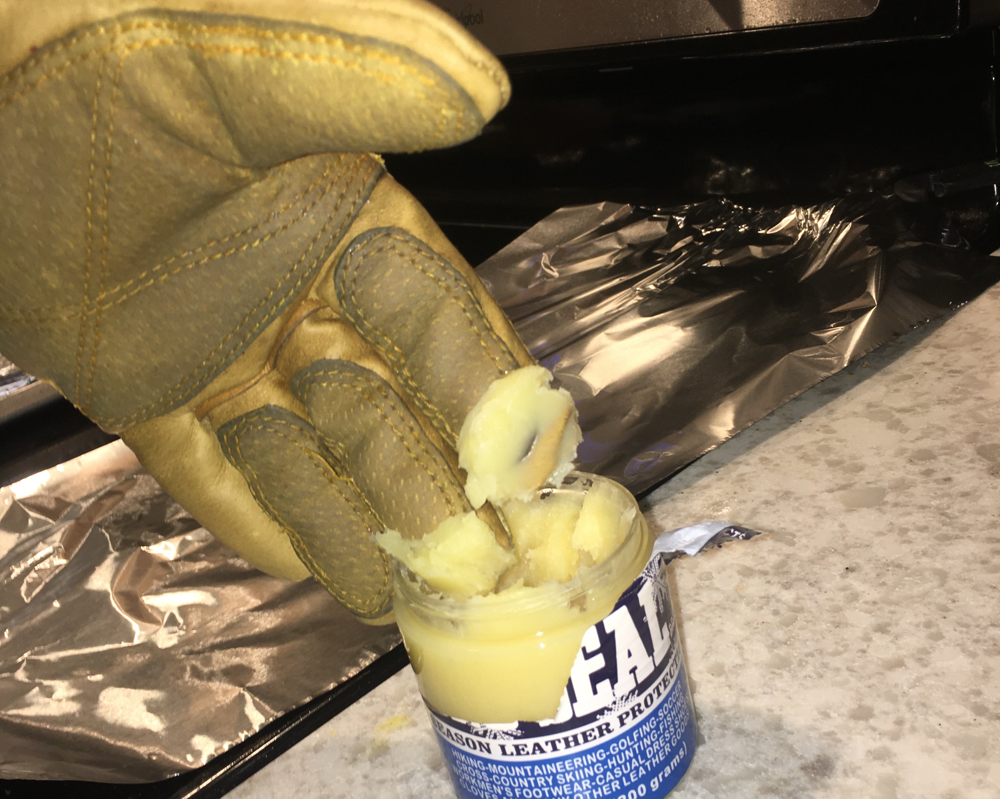
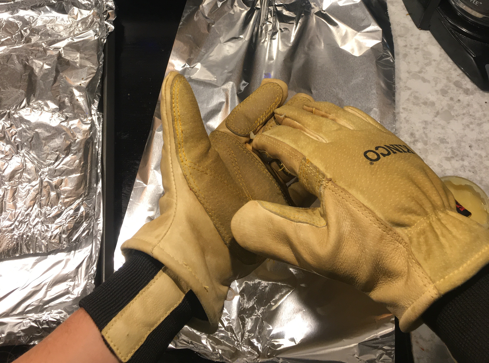
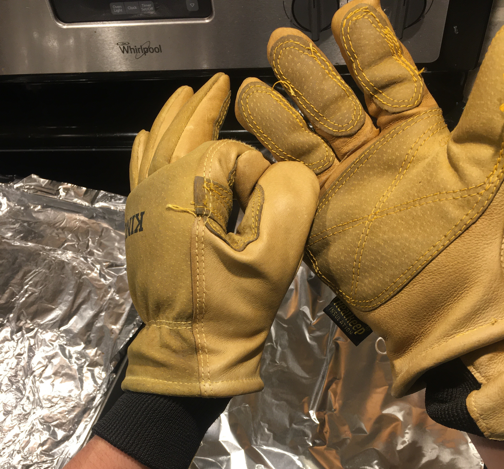
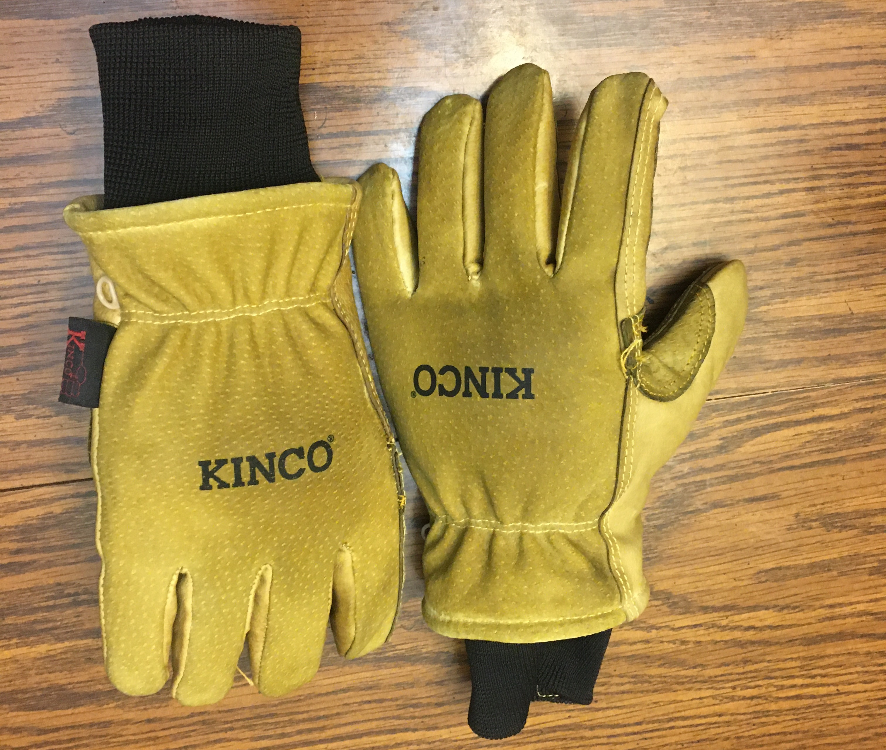

When travelling to ski resorts, you may notice skiers and snowboarders wearing the popular Kinco work gloves.
Turns out, Kincos are a cheap and sturdy alternative to [similarly styled, \$100 gloves](https://www.evo.com/gloves/burton-gondy-gore-tex-leather#image=152928/641950/burton-gondy-gore-tex-leather-gloves-.jpg).

# Materials

- Kinco Gloves
- Waterproofing Beeswax (Sno-Seal)
- Oven
- Baking Sheet
- Tin Foil

# Waterproofing Steps

### Pre-heat your oven to 150°F

- If your oven has a minimum temperature setting that's higher than this, pre-heat the oven to the minimum setting and crack the door open a bit.
- Sno-Seal recommends a temperature of 120°F. I found that heating the oven a bit more helped with absorption. Keep an eye on the gloves and be sure not to burn them!

### Prepare your baking sheet

- Line your baking sheet with tin foil and place your gloves palm side up.

### Bake gloves for 5 minutes

- Warming up the leather helps the Sno-Seal soak in and provide a water-tight seal.

### Apply Sno-Seal

- Put on the gloves (they should be nicely heated, not too hot), and flex open your fingers to open the pores in the leather.
- Take a healthy amount of Sno-Seal from the jar. Using a hand-washing motion, apply the wax to all areas of the gloves.

- Don't forget the seams!

### Place gloves in oven to set wax

- Warm the gloves for 5 minutes to help the wax soak in and to prep for another coat.

### Repeat process 2-3 times

- When the gloves no longer absorb the wax, they are fully waterproof!
- Buff excess wax with a clean rag.

- Have fun this winter with your new, waterproof gloves!